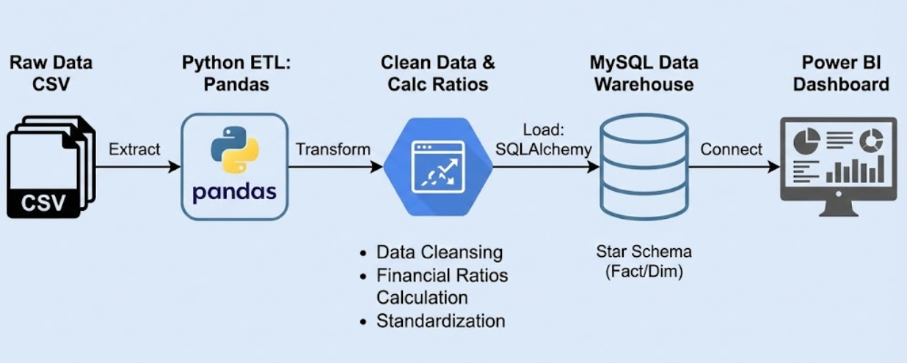
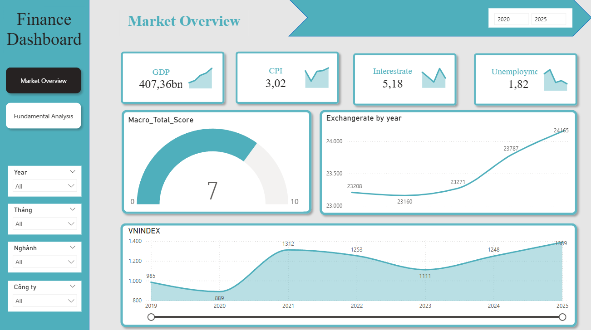
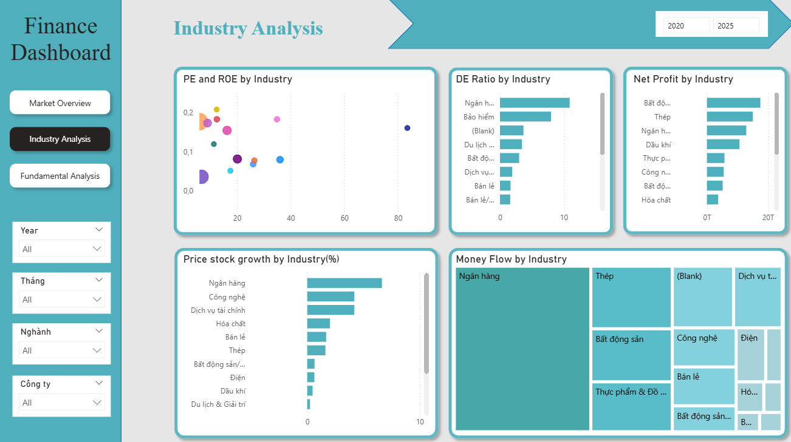
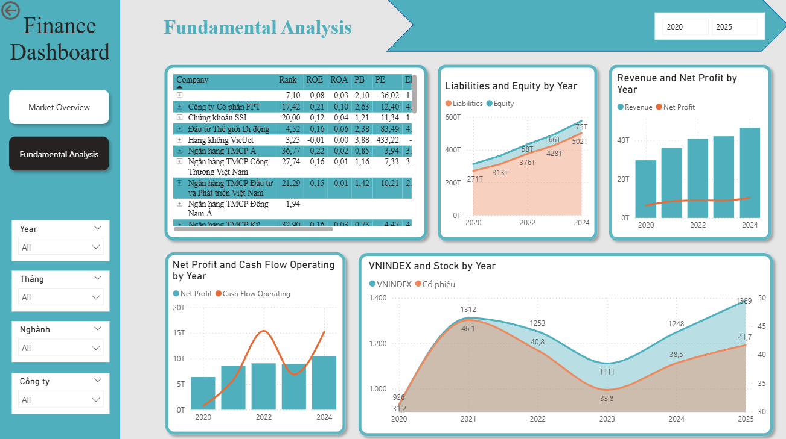

# 📑 Mục lục
📌 1. Giới thiệu

🏗 2. Kiến trúc hệ thống

📂 3. Cấu trúc dự án

🚀 4. Cài đặt & Hướng dẫn sử dụng

📊 5. Power BI Data Model(Star Schema)

📈 6. Dashboard báo cáo

---
# 📌 1. Giới thiệu
Dự án này giải quyết bài toán phân tán dữ liệu tài chính bằng cách xây dựng một Data Warehouse tập trung. Hệ thống thực hiện quy trình ETL (Extract - Transform - Load) để biến đổi dữ liệu thô từ nhiều nguồn CSV thành các bảng Fact/Dimension chuẩn chỉnh trong MySQL.


Phạm vi dữ liệu:Lịch sử giá cổ phiếu (OHLCV), Báo cáo tài chính (Cân đối kế toán, KQKD, Lưu chuyển tiền tệ), Chỉ số vĩ mô (Macro).

Điểm nổi bật:

- **_Automated ETL_**: Làm sạch, chuẩn hóa tên cột (Snake_case) và xử lý giá trị thiếu (Null) theo nghiệp vụ tài chính.

- **_Financial Engineering_**: Tính toán các chỉ số quan trọng (EPS, P/E, P/B, ROE, ROA) với độ chính xác cao dựa trên dữ liệu từ báo cáo tài chính (xử lý lệch đơn vị Đồng/Nghìn đồng).

- **_Star Schema_**: Thiết kế Database tối ưu cho truy vấn và làm báo cáo BI.
- **_Advanced Analytics(DAX)_** Thực hiện Chấm điểm Vĩ mô (Macro Scoring) và Xếp hạng Cổ phiếu (Stock Ranking) trên Power BI.


# 🏗 2. Kiến trúc hệ thống



# 📂 3. Cấu trúc dự án

```text
DA_STOCK/
│
├── data/                       # Chứa dữ liệu thô (Raw CSV: OHLCV, BCTC, Macro...)
│
├── transform/                  # Tầng xử lý dữ liệu
│   ├── cleaned_data/           # (Tự động tạo) Chứa các file CSV đã làm sạch
│   ├── transform.py            # Script chính: Làm sạch & Chuẩn hóa dữ liệu
│   └── calculate_ratios.py     # Script: Tính toán chỉ số P/E, ROE, ROA...
│
├── load/                       # Tầng nạp dữ liệu
│   └── load_to_mysql.py        # Script: Đẩy dữ liệu vào MySQL 
│
├── create_database.sql                      # SQL Scripts
│   
│
├── dashboard/                  # Hình ảnh báo cáo
│   └── overview.png            # Ảnh chụp Power BI Dashboard
│
├── requirements.txt            # Danh sách thư viện Python
└── README.md                   # Tài liệu dự án
```
# 🚀 4. Cài đặt & Hướng dẫn sử dụng
## 4.1 Yêu cầu hệ thống (Prerequisites)
- **_Python 3.8+_**

- **_MySQL Server_**

- **_Power BI Desktop_**

## 4.2 Cài đặt

**Bước 1:** Clone dự án về máy:

```powershell
git clone https://github.com/thieencao/da-stock.git

cd DA_STOCK
```
**Bước 2:** Cài đặt các thư viện cần thiết:

```Bash

pip install pandas sqlalchemy pymysql
```
**Bước 3:** Cấu hình kết nối Database: Mở file load/load_to_mysql.py và cập nhật mật khẩu MySQL của bạn:

```

DB_USER = 'root'
DB_PASS = 'your_password'  # <--- Thay mật khẩu của bạn vào đây
```
## 4.3 Chạy Pipeline
Thực hiện lần lượt các lệnh sau để vận hành hệ thống:


**Bước 1:** Khởi tạo Database 
Mở MySQL Workbench và chạy file SQL script (hoặc code tạo bảng) để tạo các bảng Dim/Fact và thiết lập Khóa chính (Primary Key).


**Bước 2:** Làm sạch dữ liệu (Transform)
```Bash

python transform/transform.py
```
**Bước 3:** Tính toán chỉ số (Enrichment)
```Bash

python transform/calculate_ratios.py
```
**Bước 4:** Nạp vào MySQL (Load)
```Bash

python load/load_to_mysql.py
```
---
# 📊 5. Power BI Data Model (Star Schema)


---
# 📈 6. Dashboard báo cáo



---





---


# da-stock

---
© 2025 thieencao — All rights reserved.
